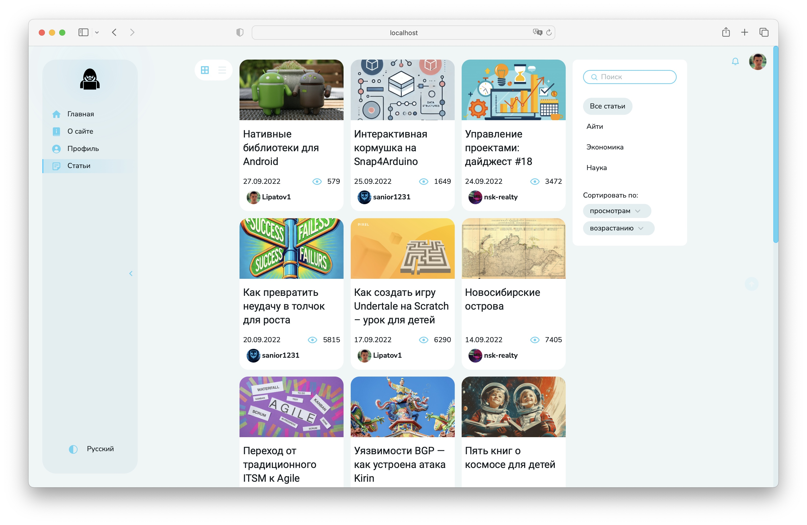
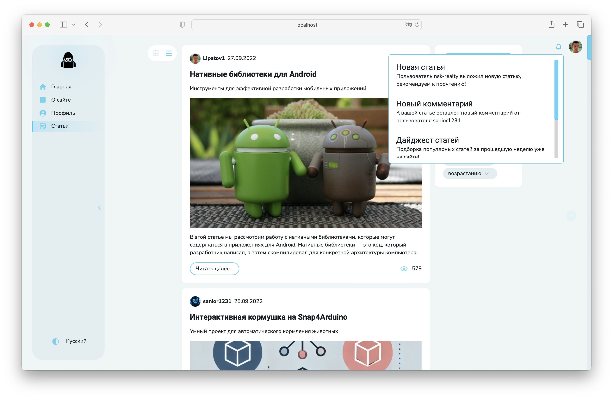
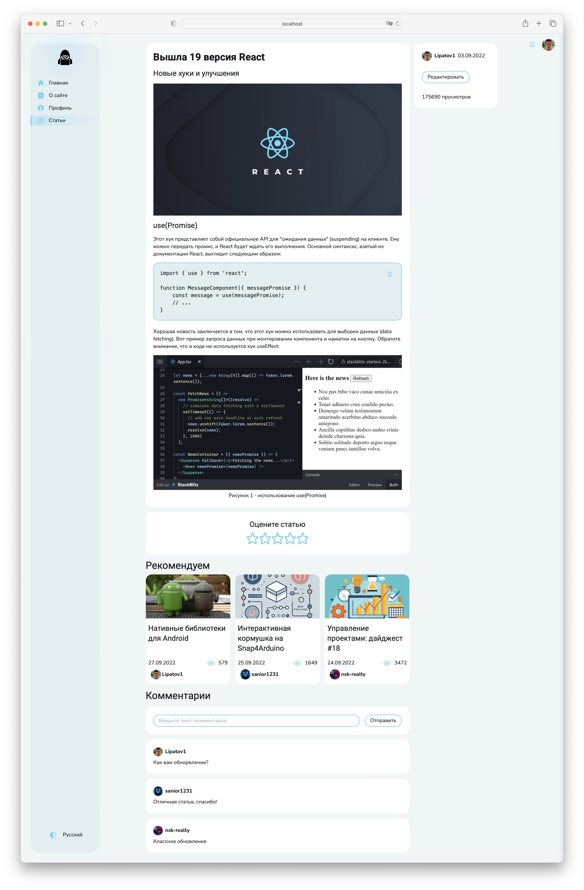
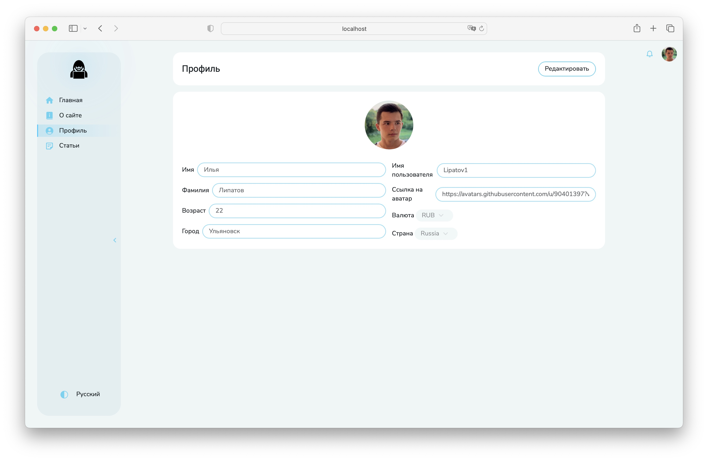
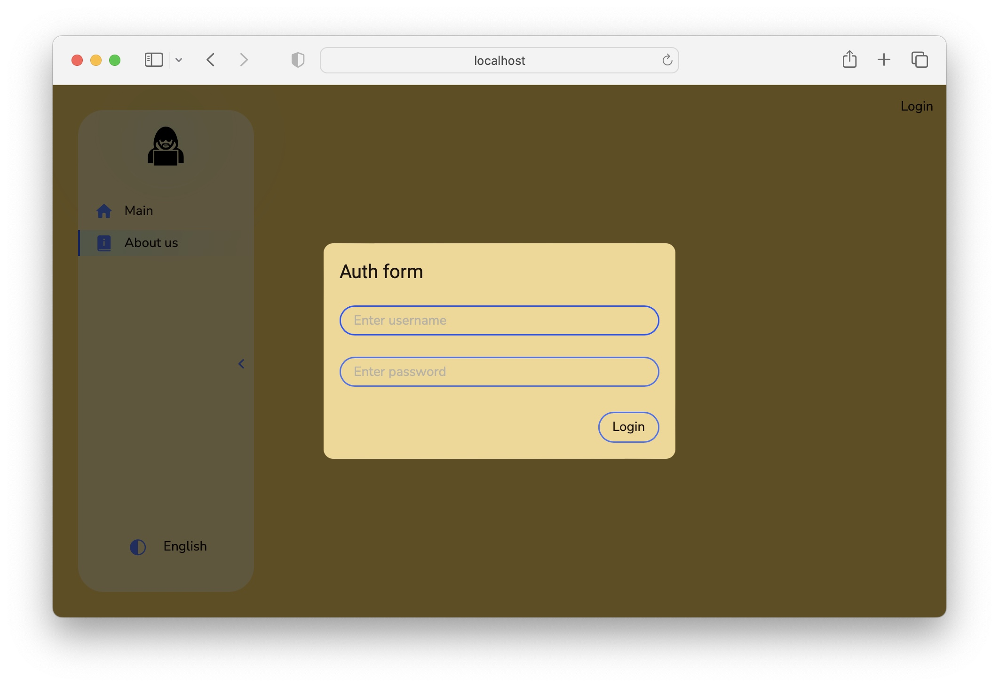

# Social

«Social» — is an online platform designed to conveniently view and publish a variety of articles on any topic. It offers users an intuitive interface that allows them to quickly find content of interest through filters and search.

### Project architecture:
The project is written in accordance with the [Feature sliced design](https://feature-sliced.design/docs/get-started/tutorial) methodology

----

### Tests:
- Unit testing (jest)
- Components testing (React testing library)
- Screenshot testing (loki)
- e2e testing (Cypress)

----

### Technology stack:
- React
- TypeScript
- Redux Toolkit
- RTK query
- Axios
- i18next
- React Router DOM
- storybook
- eslint
- prettier
- husky
- sass
- jest
- loki
- cypress
- React Testing Library

----

## Articles:

## Articles list:

## Article:

## Profile:

## Modal + theme + locale:

